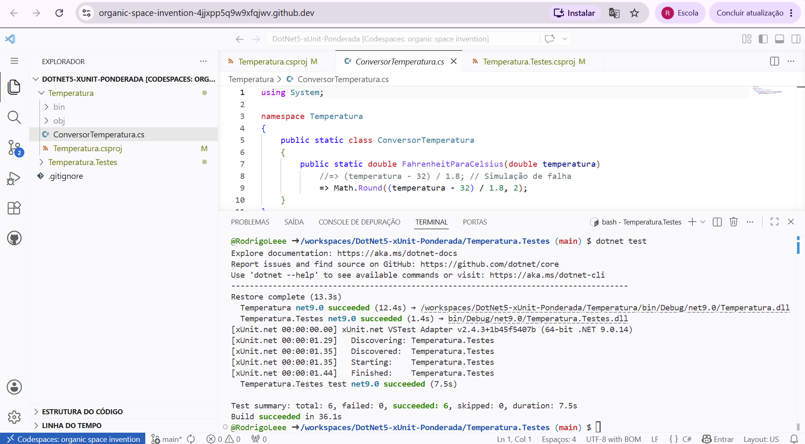
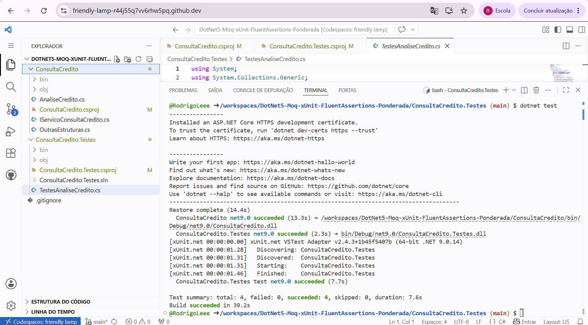
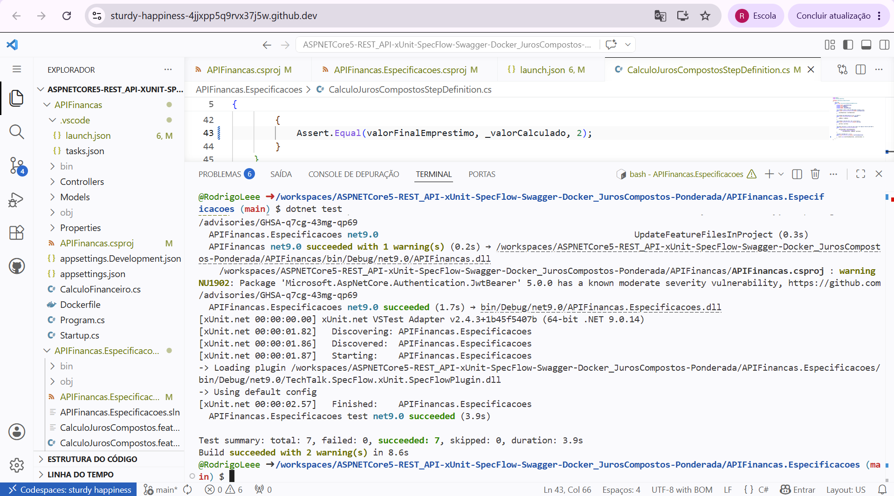

# Ponderada-Testes-de-Integração-Bem-Feitos

## Descrição

Esta atividade consiste na execução de testes automatizados em três repositórios distintos utilizando o ecossistema .NET. Para cada repositório, foi realizado um fork, seguido da execução dos testes via "dotnet test" no ambiente GitHub Codespace.

Os testes foram executados no GitHub Codespaces, em que o ambiente nativo utiliza .NET 9. Por isso, foi necessário atualizar o arquivo de projeto (".csproj") de cada repositório, alterando a versão do framework de "net5.0" para "net9.0" antes de rodar os testes.

Para cada um dos três testes, o fluxo seguido foi o mesmo: realizar o fork do repositório original, abrir o repositório no GitHub Codespace, listar os arquivos com "ls" para identificar a pasta do projeto, navegar até ela com "cd", atualizar a versão do .NET no ".csproj" de "net5.0" para "net9.0" e, por fim, executar "dotnet test".

## Testes Realizados

### 1. .NET 5 + Unit Testing + xUnit + Conversão de Temperaturas

Repositório: https://github.com/RodrigoLeee/DotNet5-xUnit-Ponderada

Teste unitário de conversão de temperaturas utilizando xUnit. Após atualizar a versão do .NET para 9, os testes foram executados com sucesso.

<br/>
<div align="center">
  <sub>Figura 1 — Teste .NET 5 + Unit Testing + xUnit + Conversão de Temperaturas</sub> <br>
   <br>
  <sup>Fonte: Material produzido pelos autores (2026)</sup>
</div>
<br/>

### 2. .NET 5 + xUnit + Moq + Fluent Assertions

Repositório: https://github.com/RodrigoLeee/DotNet5-Moq-xUnit-FluentAssertions-Ponderada

Testes utilizando xUnit em conjunto com Moq, para criação de mocks. Após atualizar a versão do .NET para 9, os testes foram executados com sucesso.

<br/>
<div align="center">
  <sub>Figura 2 — Teste .NET 5 + xUnit + Moq + Fluent Assertions</sub> <br>
   <br>
  <sup>Fonte: Material produzido pelos autores (2026)</sup>
</div>
<br/>

### 3. ASP.NET Core 5 + REST API + xUnit + SpecFlow + Swagger + Dockerfile + Juros Compostos

Repositório: https://github.com/RodrigoLeee/ASPNETCore5-REST_API-xUnit-SpecFlow-Swagger-Docker_JurosCompostos-Ponderada

Além da atualização da versão do .NET para 9, foi necessária uma correção no código de validação dos testes.

#### Correção aplicada

O teste falhava por imprecisão em números decimais. O método "Assert.Equal" foi ajustado para aceitar uma tolerância de 2 casas decimais, adicionando um terceiro argumento à chamada:

Antes:
```csharp
[Then(@"o resultado será (.*)")]
public void ValidarResultado(double valorFinalEmprestimo)
{
    Assert.Equal(valorFinalEmprestimo, _valorCalculado);
}
```

Depois:
```csharp
[Then(@"o resultado será (.*)")]
public void ValidarResultado(double valorFinalEmprestimo)
{
    Assert.Equal(valorFinalEmprestimo, _valorCalculado, 2);
}
```

O terceiro argumento "2" define a quantidade de casas decimais de precisão aceitas, resolvendo o erro causado por diferenças de arredondamento.

<br/>
<div align="center">
  <sub>Figura 3 — Teste ASP.NET Core 5 + REST API + xUnit + SpecFlow + Swagger + Dockerfile + Juros Compostos</sub> <br>
   <br>
  <sup>Fonte: Material produzido pelos autores (2026)</sup>
</div>
<br/>